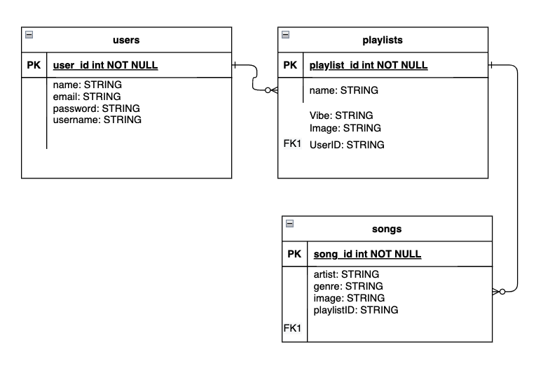
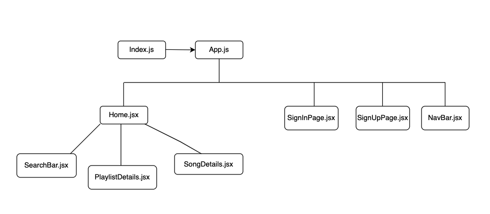

# Starred: a music app
## Date: 08/10/2022
#### By: Luke Robinson, Will Fitzgerald, Yangtsel Sherap

**[Website]() | [GitHub](https://github.com/y-sherap/Starred-React)**

---

---

#### *Description*

A ==PERN== application that allows users to:
* create an account to create and save playlists
* add songs to a playlist 
* perform full CRUD applications on their playlists
* search for songs through a 3rd party API to add to their playlist

View the project [HERE](LINK HERE)

***
#### *Technologies Used*
* Sequelize
* React JS
* Express
* Node.JS
* PostGres
* Github
* Deezer

***

#### _Project Overview_
This application is built for users interested in discovering new music.

---

### **_Screenshots_**

#### **Entity Relationship Diagram**

#### **Component Hierarchy Diagram**

---

#### _Future Updates_

- [ ] Create a social media feed that allows users to share playlists they created
- [ ] Allow users to save playlists (implementing the Many-to-many model)
- [ ] Friends model

---

#### **_Resources_**

- Draw.io
- Heroku
- Miro

---

# Starred: a music app
## Date: 08/10/2022
#### By: Luke Robinson, Will Fitzgerald, Yangtsel Sherap

**[Website]() | [GitHub](https://github.com/y-sherap/Starred-Backend)**

---

---

#### *Description*

***
#### *Technologies Used*
* Sequelize
* React JS
* Express
* Node.JS
* PostGres
* Github
* Deezer

***

#### _Project Overview_
This application is built for users interested in discovering new music.

---

### **_Screenshots_**

#### **Entity Relationship Diagram**

#### **Component Hierarchy Diagram**

---

#### _Future Updates_

- [ ] Create a social media feed that allows users to share playlists they created
- [ ] Allow users to save playlists (implementing the Many-to-many model)
- [ ] Friends model

---

#### **_Resources_**

- Draw.io
- Heroku
- Miro

---
